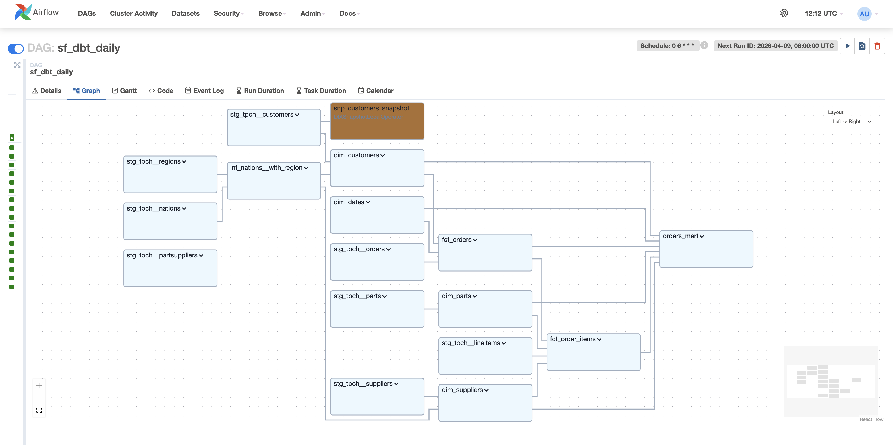
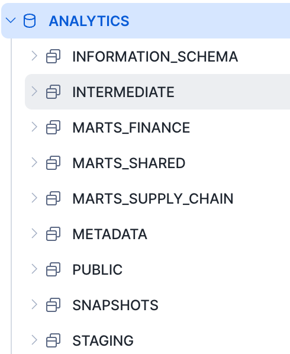
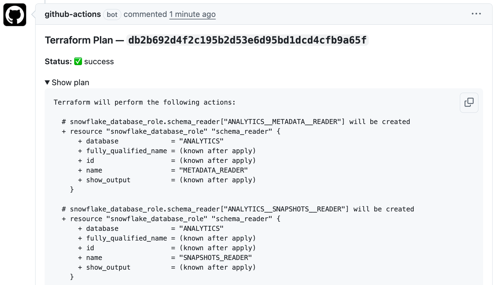

# sf-dbt

An end-to-end analytics engineering project built on Snowflake with dbt, Terraform, Airflow, and GitHub Actions.

**[dbt Docs](https://harun-kucuk.github.io/dbt-snowflake/#!/overview)** — live data catalog with model lineage, column-level documentation, and test coverage.

This project models Snowflake's TPC-H sample data through a layered dbt pipeline, provisions Snowflake infrastructure as code, and orchestrates dbt runs through Airflow. It is designed to demonstrate the kind of workflow used in a production-style modern data platform rather than a single-tool demo.

## What This Project Shows

- dbt modeling across staging, intermediate, and mart layers
- Dimensional modeling with `dim_*` and `fct_*` tables organized by business domain
- Config-driven Snowflake infrastructure managed with Terraform
- Airflow orchestration using Astronomer Cosmos
- CI/CD for dbt and Terraform with GitHub Actions
- Environment-aware development for isolated dev, CI, and production workflows

## Measurable Outcomes

- 16 dbt models across 3 layers: 8 staging, 1 intermediate, and 7 mart-layer models
- 6 Airflow DAGs: 1 daily end-to-end DAG, 4 targeted subset DAGs, and 1 ad hoc execution DAG
- 5 GitHub Actions workflows covering dbt CI, dbt deploy, dbt docs publishing, Terraform plan, and Terraform apply
- 3 business-oriented mart domains: `shared`, `finance`, and `supply_chain`
- Automated data quality coverage with schema tests on primary keys, foreign keys, and critical columns

## Architecture

```text
                          GitHub Actions
                +-------------------------------+
                | dbt CI/deploy + tf plan/apply |
                +---------------+---------------+
                                |
                                v
Snowflake TPC-H --> staging --> intermediate --> marts
 sample data        views       shared logic     dims/facts/wide marts
      |                                                    ^
      |                                                    |
      +---------------- Terraform provisions --------------+
      |        databases, schemas, warehouses, roles, users
      |
      +---------------- Airflow orchestrates dbt DAGs ----->
```

## Tech Stack

- Snowflake
- dbt Core
- Terraform
- Apache Airflow
- Astronomer Cosmos
- GitHub Actions
- Python 3.11

## Project Structure

```text
dbt/
  models/
    staging/tpch/            # Source-aligned staging views (stg_tpch__*)
    intermediate/            # Shared enrichment helpers (int_*)
    marts/
      shared/                # dim_customers, dim_dates — used across domains
      finance/               # fct_orders, fct_order_items, orders_mart
      supply_chain/          # dim_suppliers, dim_parts
  macros/
  profiles.yml

terraform/snowflake/
  config/                    # CSV-driven infra configuration
  *.tf                       # Databases, schemas, roles, users, grants, warehouses

airflow/
  dags/                      # Full and targeted dbt orchestration DAGs
  docker-compose.yml         # Local Airflow environment

.github/workflows/
  dbt-ci.yml
  dbt-deploy.yml
  dbt-docs.yml
  tf-ci.yml
  tf-deploy.yml
```

## Data Model

The dbt project models the Snowflake [TPC-H sample dataset](https://docs.snowflake.com/en/user-guide/sample-data-tpch) through three layers:

**Staging** — one view per source table: `stg_tpch__customers`, `stg_tpch__orders`, `stg_tpch__lineitems`, `stg_tpch__parts`, `stg_tpch__suppliers`, `stg_tpch__nations`, `stg_tpch__regions`, `stg_tpch__partsuppliers`

**Intermediate** — shared enrichment helpers: `int_nations__with_region`

**Marts** — consumer-facing models by domain:
- `shared`: `dim_customers`, `dim_dates`
- `finance`: `fct_orders`, `fct_order_items`, `orders_mart`
- `supply_chain`: `dim_suppliers`, `dim_parts`

## Orchestration And Deployment

- Airflow DAGs in [airflow/dags](airflow/dags) orchestrate full and targeted dbt runs.
- Terraform in [terraform/snowflake](terraform/snowflake) manages Snowflake infrastructure from CSV configuration files.
- GitHub Actions in [.github/workflows](.github/workflows) handles dbt validation/builds and Terraform plan/apply automation.

## Design Decisions

- Keep the dbt project in three layers: `staging`, `intermediate`, and `marts`, with dimensions and facts living inside `marts` rather than a separate warehouse folder.
- Use surrogate keys on `dim_*` and `fct_*` models while preserving natural keys for lineage, joins from staging, and BI-facing identifiers.
- Introduce an intermediate layer only for shared logic reused across multiple mart models, avoiding duplicated joins while keeping staging models simple.
- Publish both reusable star-schema components (`dim_*`, `fct_*`) and a denormalized presentation model (`orders_mart`) to show both modeling discipline and analyst-friendly delivery.
- Manage Snowflake infrastructure from CSV-driven Terraform inputs to make role, warehouse, schema, and user changes auditable and repeatable.

## Local Setup

Prerequisites:

- Python 3.11+
- Snowflake account

Setup:

```bash
python3 -m venv .venv
source .venv/bin/activate
pip install -r requirements.txt

cp .env.example .env
# Edit .env with your Snowflake credentials

set -a && source .env && set +a
cd dbt
dbt debug
dbt deps
```

## Running dbt

Run from `dbt/` after activating the virtual environment and sourcing `.env`:

```bash
dbt build --target dev -s <selection>
dbt test --select <selection>
dbt docs generate
dbt docs serve
```

## Running Airflow Locally

Prerequisites: Docker Desktop running.

```bash
# First-time setup
cp airflow/.env.example airflow/.env
# Fill in Snowflake credentials and generate a Fernet key:
python -c "from cryptography.fernet import Fernet; print(Fernet.generate_key().decode())"
# Add the output as AIRFLOW__CORE__FERNET_KEY in airflow/.env

cd airflow
docker compose up airflow-init   # initialise DB, create admin user, register Snowflake connection
docker compose up -d             # start webserver + scheduler
```

UI available at http://localhost:8080 — username `admin`, password `admin`.

```bash
# Trigger a run manually
docker compose exec airflow-scheduler airflow dags trigger sf_dbt_daily

# Check run status
docker compose exec airflow-scheduler airflow dags list-runs -d sf_dbt_daily

# Restart after credential or config changes
docker compose down && docker compose up -d
```

> **Note:** If shell environment variables (e.g. `SNOWFLAKE_WAREHOUSE`) are exported in your current session, they override `airflow/.env`. Either unset them first or prefix the command: `SNOWFLAKE_WAREHOUSE=DATA_VWH docker compose up -d`.

## Screenshots

**Airflow DAG — full pipeline graph**


*Left to right: staging views → `int_nations__with_region` → dims + facts → `orders_mart`. The `snp_customers_snapshot` node at the top tracks customer attribute changes over time (Type 2 SCD).*

**Snowflake — ANALYTICS database schemas provisioned by Terraform**


*All schemas created by Terraform from `schemas.csv`: `STAGING`, `INTERMEDIATE`, `MARTS_FINANCE`, `MARTS_SHARED`, `MARTS_SUPPLY_CHAIN`, `SNAPSHOTS`, and `METADATA` (audit log table).*

**Terraform plan posted automatically on GitHub PR**


*`tf-ci.yml` runs `terraform plan` on every PR and posts the output as a PR comment — infrastructure changes are reviewed before merge, never applied blindly.*
